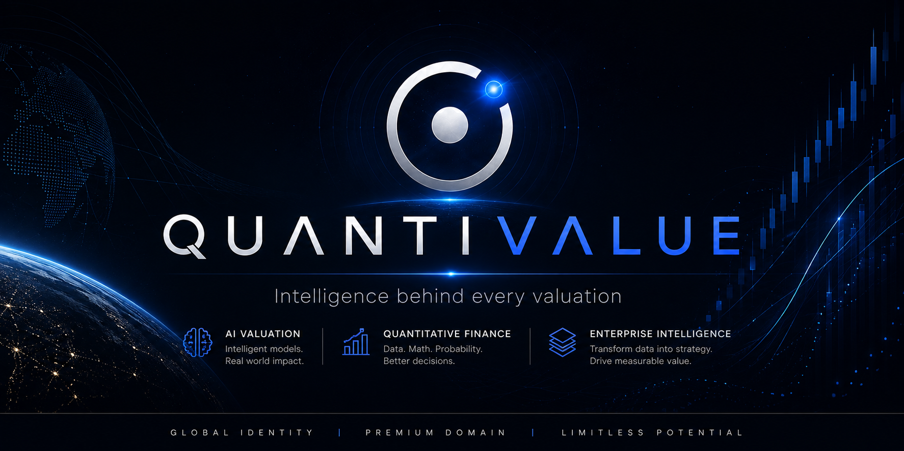

  

# QUANTIVALUE

### Intelligence behind every valuation

Enterprise identity built for artificial intelligence, quantitative finance and intelligent decision-making.

[Website](https://quantivalue.com) • Brand Book • Make an Offer

---

AI Valuation • Quantitative Finance • Enterprise Intelligence

---

# About

QuantiValue is a premium global brand positioned at the intersection of artificial intelligence, quantitative finance and enterprise intelligence.

The identity combines mathematical precision, strategic thinking and commercial value into a single internationally recognizable name.

Designed for long-term positioning, QuantiValue is suitable for enterprise software, AI infrastructure, financial analytics, valuation platforms, investment intelligence and institutional technology products.

Rather than representing a single application, QuantiValue was conceived as a scalable brand architecture capable of supporting multiple products, services and enterprise ecosystems.

---

# Vision

Create one of the world's strongest premium identities for artificial intelligence and financial technology.

QuantiValue is designed to remain relevant for decades, independent of short-term technology trends.

The objective is to become a globally recognized enterprise brand associated with intelligence, trust and measurable value.

---

# Why QuantiValue

- Premium .COM domain
- AI-native positioning
- Enterprise-ready identity
- Immediate semantic clarity
- International pronunciation
- Strong commercial perception
- Long-term brand architecture
- High acquisition potential

---

# Brand Principles

| Principle | Description |
|------------|-------------|
| Intelligence | Transform complexity into strategic insight |
| Precision | Mathematical thinking and rigorous execution |
| Trust | Institutional credibility across global markets |
| Longevity | Built to remain relevant for decades |
| Commercial Value | Every decision should increase perceived value |

---

# Technology Focus

- Artificial Intelligence
- AI Valuation
- Quantitative Finance
- Enterprise Analytics
- Investment Intelligence
- Financial Infrastructure
- Decision Intelligence
- Data Platforms

---

# Brand Assets

The QuantiValue identity system includes:

- Quantum Ring
- Wordmark Master
- Logo System
- Color System
- Typography
- Open Graph Collection
- Brand Book
- Corporate Identity
- Press Kit

---

# Roadmap

| Status | Project |
|---------|---------|
| ✅ | Premium Landing Page |
| ✅ | Cloudflare Infrastructure |
| ✅ | Acquisition Platform |
| ✅ | SEO Optimization |
| ✅ | Brand Identity |
| 🚧 | Brand Asset Kit |
| 🚧 | Investor Deck |
| 🚧 | Acquisition Deck |
| 🚧 | Press Kit |
| 🚧 | Corporate Identity System |

---

# Acquisition

QuantiValue is being developed as a premium global brand.

Its identity, infrastructure and positioning are intentionally designed to maximize long-term enterprise value and strategic acquisition potential.

---

# Contact

Website

https://quantivalue.com

Business

contact@quantivalue.com

---

### QUANTIVALUE

Intelligence behind every valuation

© 2026 QuantiValue

